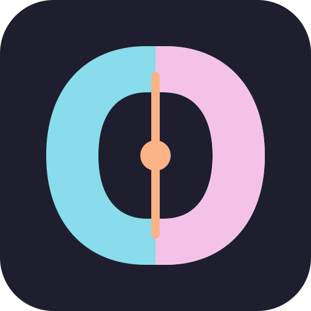
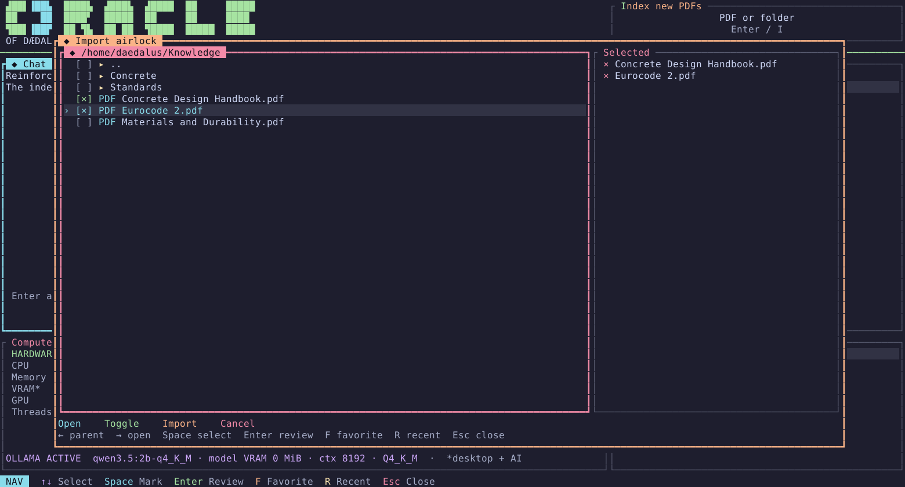
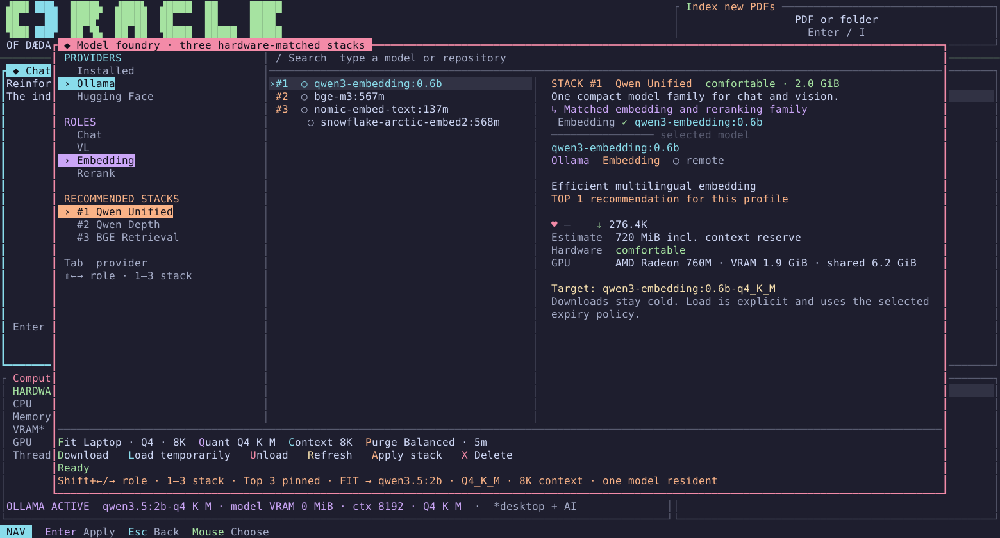
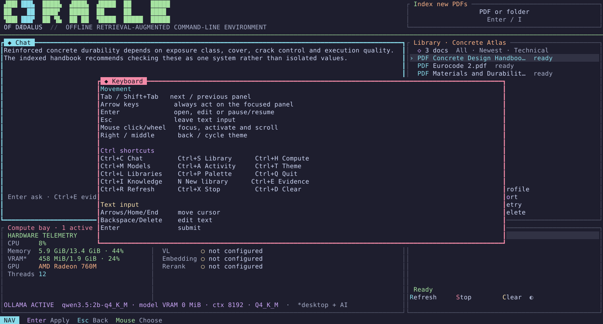

<p align="center">
  
</p>

<h1 align="center">ORACLE OF DÆDALUS</h1>
<p align="center"><strong>Offline Retrieval-Augmented Command-Line Environment</strong></p>
<p align="center">
  Turn a folder of PDFs into a private, cited knowledge library—without leaving the terminal.
</p>

<p align="center">
  <a href="https://github.com/Baulehrer/oracle-of-daedalus/actions/workflows/ci.yml"></a>
  <a href="https://github.com/Baulehrer/oracle-of-daedalus/releases/latest"></a>
  <a href="https://github.com/Baulehrer/oracle-of-daedalus/pkgs/container/oracle-of-daedalus"></a>
  
</p>


## Your books. Your machine. Answers with receipts.

Oracle of Dædalus is a colorful terminal workbench for local knowledge. Select PDFs or whole
folders, let the library index in the background, then ask questions in plain language. Every
answer stays connected to its evidence: title, page, excerpt, layout position and—where
available—the original figure or table.

- **Library instead of file pile.** Create focused libraries, watch indexing progress, tag and
  filter documents, retry failures and safely remove or restore material.
- **Sources you can inspect.** Open a citation directly at the matching PDF page. Evidence
  previews highlight the original area; up to four relevant visual sources can sit beside an
  answer.
- **Structure-aware reading.** Docling preserves headings, paragraphs, lists and tables so chunks
  follow the document rather than arbitrary character counts.
- **Large-book friendly.** Long PDFs are processed in bounded page segments. There is no product
  limit on file size or page count.
- **A model foundry for the machine you own.** Browse Chat, VL, Embedding and Rerank roles; compare
  downloads and popularity; choose quantization; or install one of three hardware-matched model
  stacks.
- **Designed not to eat the laptop.** Only one heavy operation runs at a time, chat gets priority
  before the next indexing segment, and model residency can be temporary. Systemd and Docker add
  hard memory ceilings.
- **Terminal-native, not keyboard-exclusive.** Tab and arrow navigation, direct shortcuts,
  Shift+Arrow role switching, mouse focus, scrolling and clickable actions all work together.
- **Local-first.** The bridge talks to a normal, unmodified Haiku RAG 0.70 runtime and a local
  Ollama service. Libraries, models and tokens remain on your machine.

## See it in motion

| Add knowledge | Hardware-matched models |
|---|---|
| [](docs/screenshots/knowledge-browser.png) | [](docs/screenshots/model-foundry.png) |
| Select several PDFs or folders with `Space`, review once, then index. | Compare roles, memory fit, quantization and three recommended stacks. |

| Keyboard and mouse help |
|---|
| [](docs/screenshots/keyboard-and-mouse.png) |

## Start in one command

Linux x86_64, Ollama and a working internet connection for the first model download are required.

```bash
curl -fsSL https://github.com/Baulehrer/oracle-of-daedalus/releases/latest/download/install.sh \
  | sh
oracle
```

The installer creates a private local token, installs the client and full Haiku-backed daemon,
enables conservative memory limits, and schedules a randomized weekly update check. Keep the
current version without the timer with `--no-auto-update`.

Prefer to inspect first?

```bash
curl -fLO https://github.com/Baulehrer/oracle-of-daedalus/releases/latest/download/install.sh
less install.sh
sh install.sh
```

### Portable AppImage

The AppImage is the small console client. It connects to the daemon installed above or to a
Docker-hosted daemon; it intentionally does not bundle Python, Haiku, models or your libraries.

```bash
chmod +x Oracle-of-Daedalus-0.5.0-x86_64.AppImage
./Oracle-of-Daedalus-0.5.0-x86_64.AppImage
```

It contains GitHub zsync update metadata, so `AppImageUpdate` can apply binary-delta updates when
that tool is available. The installed `oracle-update` command works independently of it.

### Docker backend

```bash
export OMARAG_TOKEN="$(openssl rand -hex 32)"
docker compose -f deploy/compose.yaml up -d
docker compose -f deploy/compose.yaml ps
```

The CPU image runs without root privileges, stores libraries in a named volume, reaches Ollama on
the host through `host.docker.internal`, and exposes the API only on `127.0.0.1:8765`.

## The few controls worth remembering

| Control | Action |
|---|---|
| `Tab` / `Shift+Tab` | Move between panels |
| Arrow keys | Move everywhere; `Shift+←/→` changes model role |
| `Enter` | Open, confirm or start typing in Chat |
| `Space` | Select PDFs and folders in the browser |
| `I` | Index new PDFs |
| `M` | Open the model foundry |
| `T` | Cycle the four themes |
| `?` | Show contextual help |
| `Ctrl+Z` | Undo the latest supported library action |
| Mouse | Focus, choose, scroll and activate visible controls |

## What “offline” means here

Questions, indexing and model inference run locally. Network access is only needed when you ask
the model foundry to download something, when the updater checks GitHub, or when you explicitly
configure a remote provider. The default library profile does none of those during normal use.

Oracle keeps operational metadata in SQLite and lets **Vanilla Haiku RAG** remain the sole owner
of the vector database. It does not patch or fork Haiku's retrieval behavior.

## Release 0.5 boundaries

- Linux x86_64 is the supported packaged platform.
- The backend is local-first; remote library preview is not part of this preview.
- Visual evidence is derived from page provenance. Dedicated figure extraction will continue to
  improve without changing citation URLs.
- Model compatibility is a conservative estimate, not a promise that another desktop workload
  cannot consume the remaining RAM or VRAM.

Found a sharp edge? [Open an issue](https://github.com/Baulehrer/oracle-of-daedalus/issues) with
the visible error and the `Activity` entry—never attach your private PDFs or auth token.

## License

Licensed under MIT.
