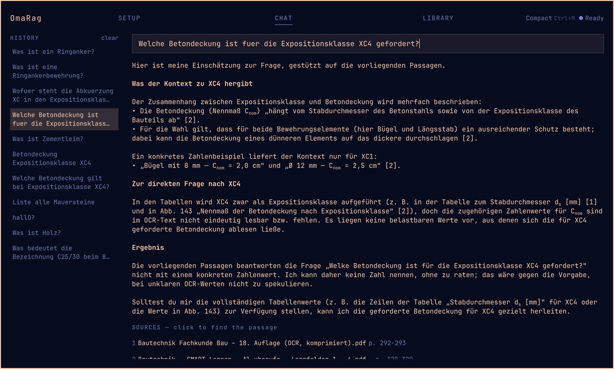
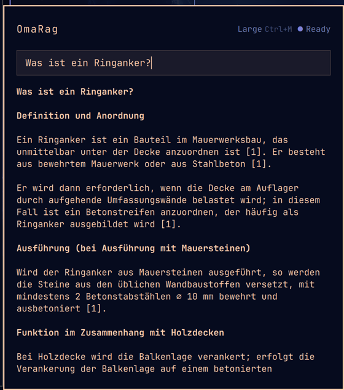
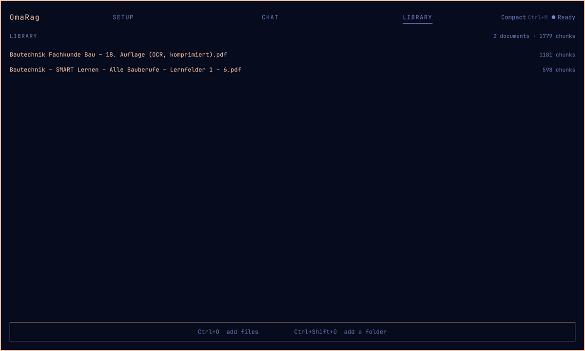
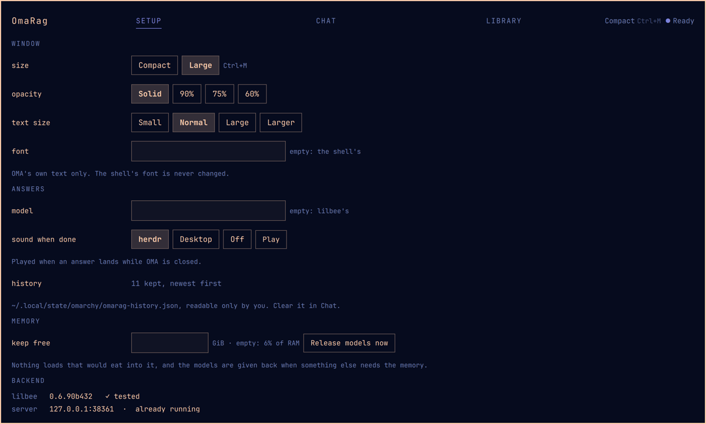

# OMA

**Ask your own books. See the page the answer came from.**

OMA is a window into the documents on your own machine — textbooks, standards,
manuals, notes. You ask a question in your own words, you get an answer built
only from what your documents actually say, and every claim carries a source you
can click to open the book at that page.

Nothing leaves your computer.



## Why

A search box finds pages. A chatbot invents. OMA does neither: it reads your
documents, answers from them, and shows its work. Ask it something your library
does not cover and it says so instead of making something up.

It is built for people with a shelf of professional literature — a teacher, an
engineer, a lawyer, anyone who needs the answer *and* the page it stands on.

## Install

Two things: OMA, and [lilbee](https://github.com/tobocop2/lilbee), which does
the reading and holds your library.

```bash
mise use -g github:tobocop2/lilbee     # the engine
omarchy plugin add https://github.com/Baulehrer/OmaRag.git --enable
omarchy restart shell
```

A button appears in your bar. Click it, press `Ctrl+O`, and point OMA at a PDF
or a folder of them. The first import takes a while — after that, questions take
about half a minute.

Add a keyboard shortcut if you like, in `~/.config/hypr/bindings.lua`:

```lua
o.bind("SUPER + A", "OMA local knowledge", "omarchy-shell shell toggle kaufmann.omarag '{}'")
```

## Using it

|  |  |
|---|---|
| `Enter` | ask — the answer comes from your documents |
| `Ctrl+Enter` | just find the passages, no answer |
| click a source | opens the book at the passage that was used |
| `Ctrl+O` · `Ctrl+Shift+O` | add files · add a folder |
| `Ctrl+M` | switch between the large and the small window |
| `Esc` | stop, step back, close |

Close OMA while a question is running and it keeps thinking. The bar icon
breathes, and when the answer is ready it chimes and puts a dot on the icon.

### Two windows

The large one fills the screen. The small one opens under the bar icon and
shows the chat alone, for when you are working next to it.



### Your library



Everything you have added, and what it costs in chunks. Documents stay where
they are on disk — OMA only reads them.

### Settings



Window size, transparency, text size, the sound when an answer lands while OMA
is closed, and how much memory to leave for everything else. Below that, the
engine's own settings, with its own help text.

## What it will not do

* **Nothing leaves your machine.** Three buttons reach the network — check for
  an update, search the model catalogue, download a model — and each says so
  before it does it. Nothing on a timer, nothing on opening a window.
* **No cloud, no account, no telemetry, no root.**
* **It will not fill your memory.** Before loading anything, OMA checks there is
  room, and it gives the models back when something else on the machine needs
  them.
* **It will not answer from thin air.** No documents on the subject, no answer.

## Requirements

Omarchy with its Quickshell bar, and `lilbee` on your `PATH`. That is all — no
npm, no pip, nothing else to install.

A document viewer for the "open the page" button: zathura, okular or evince.

## License

MIT. See [DEVELOPING.md](docs/DEVELOPING.md) if you want to work on it.
