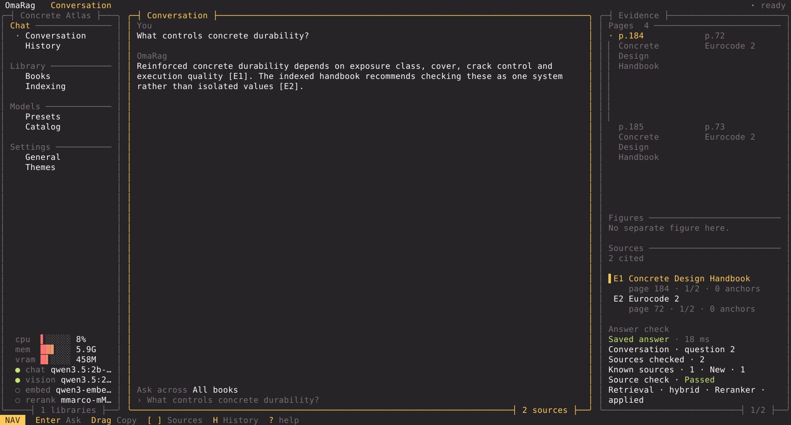

<p align="center">
  
</p>

<h1 align="center">OmaRag</h1>

<p align="center">
  <strong>Deine Fachbücher. Deine Fragen. Antworten mit Seitenangabe.</strong>
</p>

<p align="center">
  <a href="https://github.com/Baulehrer/OmaRag/releases/latest">Neueste Version</a> ·
  <a href="https://github.com/Baulehrer/OmaRag/issues">Hilfe</a>
</p>



## Was ist OmaRag?

OmaRag macht aus deinen PDF-Fachbüchern eine private Wissensbibliothek.

Du fügst Bücher hinzu und stellst Fragen in normaler Sprache. OmaRag sucht die passenden Stellen,
erstellt eine verständliche Antwort und zeigt dir, aus welchem Buch und von welcher Seite sie
stammt.

Deine Bücher und Fragen bleiben auf deinem Rechner.

## Was kann OmaRag?

- ganze Bücher und Ordner einlesen;
- Inhaltsverzeichnisse, Kapitel, Register und Glossare erkennen;
- passende Textstellen auch bei schwierigen Fragen finden;
- Antworten mit Buch, Seite und Originalausschnitt belegen;
- große Bücher schrittweise verarbeiten und unterbrochene Vorgänge fortsetzen;
- mehrere Bibliotheken für unterschiedliche Themen verwalten;
- vollständig mit Tastatur oder Maus bedient werden.

## Installation

Du brauchst einen Linux-PC mit x86-64-Prozessor und [Ollama](https://ollama.com/). 16 GB
Arbeitsspeicher sind empfohlen.

Öffne ein Terminal und führe aus:

```bash
curl -fsSL https://github.com/Baulehrer/OmaRag/releases/latest/download/install.sh | sh
```

Danach startest du OmaRag mit:

```bash
oracle
```

Beim ersten Start hilft dir OmaRag dabei, ein passendes Modell einzurichten.

## Die ersten Schritte

1. Erstelle eine Bibliothek.
2. Füge deine PDF-Bücher hinzu.
3. Warte, bis die Bücher fertig eingelesen sind.
4. Öffne den Chat und stelle deine Frage.
5. Wähle eine Quelle aus, um die Originalseite zu sehen.

## Aktualisieren

```bash
oracle-update
```

Nach einem großen Update kann OmaRag eine vollständige Neuindexierung verlangen. Deine
Originalbücher bleiben dabei erhalten.

## AppImage

Auf der Seite [Releases](https://github.com/Baulehrer/OmaRag/releases/latest) findest du zusätzlich
eine portable AppImage. Sie ist nur die Benutzeroberfläche und verbindet sich mit dem installierten
OmaRag-Dienst.

## Datenschutz

Die normale Suche, das Einlesen und die Antworten laufen lokal. Eine Internetverbindung wird nur
für Installation, Updates und das Herunterladen von Modellen benötigt.

## Hilfe

Wenn etwas nicht funktioniert, starte zuerst:

```bash
oracle-cli doctor
```

Du kannst anschließend ein [GitHub-Issue](https://github.com/Baulehrer/OmaRag/issues) erstellen.
Bitte lade dort keine privaten Bücher oder Zugangsdaten hoch.

## Lizenz

OmaRag steht unter der MIT-Lizenz.
